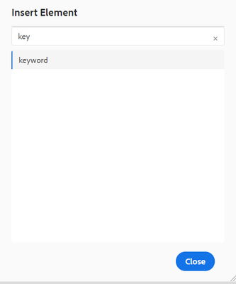

# Create global keys

Use case: Organizations should use keys in cases where they have some resuable and common text, like product name or product pitch, that is used in many places but is prone to change. Using keys for such reusable text allows Authors to push an update in multiple places by making the change at a single location i.e. in the key value.

**Step 1**

Create a global map for storing your keys. Create a map and add the keyref element to it.

```

<?xml version="1.0" encoding="UTF-8"?>
<!DOCTYPE map PUBLIC "-//OASIS//DTD DITA Map//EN" "technicalContent/dtd/map.dtd">
<mapid="map.ditamap_ffbdbf06-8658-4311-ad84-1c631bba904f">
  <title>global-keys-map</title>
  <keydefkeys="adobe">
    <topicmeta>
      <linktext>Adobe Systems</linktext>
    </topicmeta>
  </keydef>
  <keydefkeys="AEM">
    <topicmeta>
      <linktext>Adobe Experience Manager</linktext>
    </topicmeta>
  </keydef>
</map>

```

Here we have defined two definitions, as shown above, provided a keyref as “AEM” for the “Adobe Experience Manager” text.

**Step 2**

Now add this map to your publication map.

```

<?xml version="1.0" encoding="UTF-8"?>
<!DOCTYPE map PUBLIC "-//OASIS//DTD DITA Map//EN" "technicalContent/dtd/map.dtd">
<mapid="map.ditamap_cbf4a96d-e382-4e8c-8830-bcc093fe6638">
  <title>sample-map</title>
  <topicrefhref="sample-topic-using-the-keys.dita"type="topic">
  </topicref>
  <maprefformat="ditamap"href="global-keys-map.ditamap"type="map">
  </mapref>
</map>

```

**Step 3** 
Use the keys to refer to any of the variables defined in the global key map.

+ Edit the topic and add the key value using the keyref.
+ As shown in screenshot, a small window will appear from where keywords can be chosen. This will show when you add the “keyword” element.



```

<?xml version="1.0" encoding="UTF-8"?>
<!DOCTYPE topic PUBLIC "-//OASIS//DTD DITA Topic//EN" "technicalContent/dtd/topic.dtd">
<topicid="topic.dita_31b00e61-04b5-4193-af7a-68503e88b087">
  <title>sample-topic-using-the-keys</title>
  <shortdesc></shortdesc>
  <body>
    <p>This is a sample topic using the keys defined in the global map</p>
    <p>here i am using the key definition for AEM :<keywordkeyref="AEM"></keyword></p>
  </body>
</topic>

```

