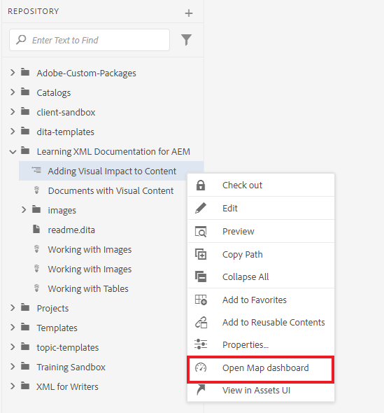
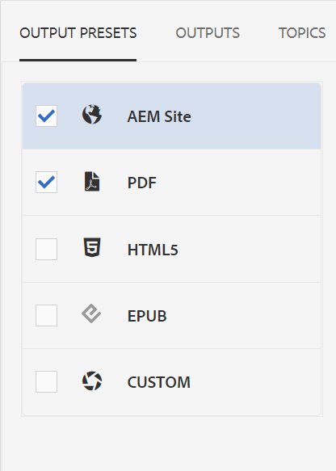
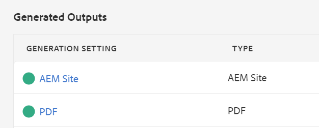

# Publishing Default Output

Once you have a completed map, you can publish your content in multiple output formats.

>[!VIDEO](https://video.tv.adobe.com/v/336662?quality=12&learn=on)

## Publishing your map as an AEM Site and a PDF

There are a number of output presets available for you to choose from. This guide will focus on the AEM Site and PDF outputs.

1. In the repository, select the ellipsis icon on your map to open the Options menu, and then **Open in Map Dashboard.**

   

   The Map Dashboard opens in another tab.

2. In the Output Presets tab, select AEM Site and PDF.

   

3. Select **Generate.**

4. Navigate to the Outputs page to view the status of your generated outputs.

   A green circle indicates that generation is complete.

   

## The AEM Site Output

In the AEM site output, topics, lists, images, titles, tables, and other content created with the XML Editor are all automatically published to web-friendly content by AEM.

You can see subordinate topics in the table of contents as well as in the Related information section. These links can all be used to navigate.

## The PDF Output

The finished PDF document contains the default title of the map as the main title on the cover page. Chapter cover pages are styled with the chapter number, and contain links to the topics within.
