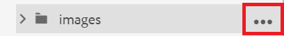
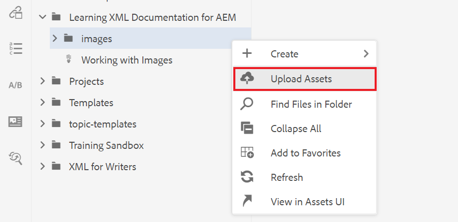

# Working with Images

The following will walk you through uploading and inserting an image, as well as how to save a new version of a topic.

You can download the example image file from ![here.] (assets/working-with-images/SignInScreen.png)

>[!VIDEO](https://video.tv.adobe.com/v/336661?quality=12&learn=on)

## Uploading an image

1. Hover over your subfolder and select the ellipsis icon to open the Options menu.

   

1. Select **Upload Assets**.

   

1. Select the image you would like to upload from your local system, and select **Open**.

   The Upload Assets dialog box displays.
1. Select **Upload**.

## Inserting an image into a topic

There are multiple ways to insert an image into your topic.

You can drag and drop an image from your local system into your topic. If your image is already uploaded, you can also drag and drop it directly into your topic from the left rail. Alternatively, you can use the Insert Image button to insert images that are currently not visible in the left rail, and to further configure your image before inserting it.

For the following, ensure that your topic is open in the document editor.

### Inserting an image with drag and drop

1. Select the image file from your local system or the left rail, and drag and drop it into your topic.

   Your image displays in the editor.

### Inserting an image with the Insert Image button

1. Select the **Insert Image** icon.

   ![Insert Image icon](images/lesson-4/insert-image.png

   The Insert Image dialog box appears.

1. Select the folder icon next to the Select File field to search for your image or navigate to its location inside the Repository.
1. Select the image&#39;s icon, and then **Select**.

   ![Select image](images/lesson-4/select-image-with-markings.png

   The Insert Image dialog box appears with the information of your chosen image.

1. Enter text in the Figure Title and Alternate Text fields as needed.
1. Select **Insert**.

   Your image displays in the editor, along with its figure title.

## Removing an image from a topic

1. Select the image in the document editor and press the **Delete** key.

## Saving a new version of a topic

Versioning allows you to review and compare different versions. You can even roll back to a previous version.

As you have made a significant change to your topic, you may now find it useful to save your current work as a new version.

1. Select the **Save as New Version** icon.

   ![Save as New Version icon](images/common/save-as-new-version.png

   The **Save as New Version** dialog box displays.

1. In the Comments for new Version field, enter a brief but clear summary of changes.
1. In the Version Labels field, enter any relevant labels.

   Labels allow you to specify the version you want to include when publishing.
   >[!NOTE] 
   > 
   > If your program is configured with predefined labels, you can select from these to ensure consistent labelling. 
1. Select **Save**.

   You have created a new version of your topic, and the version number is updated.
