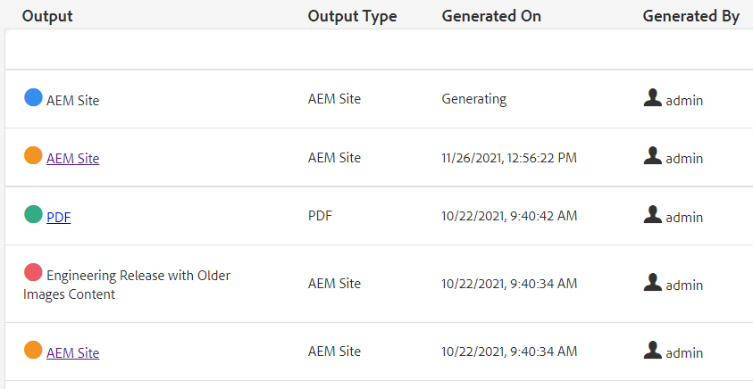

# Bulk Publishing

When publishing there is often a need for more than one type of documentation. Using Map Collections you can control the number and types of output that will be assembled and generated and kick off bulk publishing. The Publish Dashboard allows you to view active publish jobs. The Bulk Publish Dashboard provides a way to activate collections in bulk.

>[!VIDEO](https://video.tv.adobe.com/v/338985)

## Working with Map Collections

Using Map Collections, you can control the types of output that will be generated for one or more map.

### Create Map Collections

1. In the Navigation menu, click **Assets**. 

2. Select Map Collections.

3. Click **Create**.

4. Type a Collection Title.

    

5. Click **Create**.
6. Close the success message.

7. Open the map collection (click the gray section below the tile)

8. Click **Edit**.

9. Add maps as required.

10. Select or deselect **Output Presets** for each map.

11. Click **Done**.

### Filtering map presets

1. Open a map preset.

2. Under **Filter** expand and select options as needed.

### Generating content in a Map Collection

1. Open a map preset.

2. If desired, click **Generate All**.

3. OR, select the maps and output types to generate and click **Generate Selected**.

4. If required, switch to the Outputs tab.
 
5. Review the output.

## Viewing active publish jobs in the Publish Dashboard

The Publish Dashboard allows you to view active 
publish jobs. It shows a dynamic list of maps and their current status. You can track, manage, or cancel publishing workflows.

1. In Navigation view, click the **Tools** icon.

2. Click **XML Documentation**.

3. Select the **Publish Dashboard** tile.

        If the dashboard is blank there are no publish jobs running.

4. Filter the dashboard as needed to view all publishing jobs.

### Working with the Bulk Publish Dashboard

The Bulk Publish Dashboard allows you to work with Bulk Activation Collections and control multiple types of output.

### Creating a Bulk Activation Collection

1. In Navigation view, click the **Tools** icon.

2. Click **XML Documentation**.

3. Select the **Bulk Publish Dashboard** tile.

4. Type a Collection Title.

5. Click **Create**.

6. Click **Open**.

7. Open the map collection (click the gray section below the tile)

8. Click **Edit**.

9. Add maps as required.

10. Select or deselect **Output Presets** for each map.

11. Click **Done**.

12. Close the map collection when done.

### Quick Publish a Bulk Activation Collection

1. Select a Bulk Activation Collection tile.

2. Click **Open**.

3. Select one or more maps.

4. Click **Quick Publish**.
