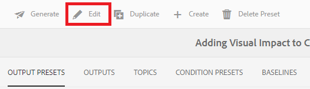

# Creating and Publishing With Baselines

Using a baseline allows you to create a version of your map topics and related reference content. This can be based on a specific date or time, or labels. 

>[!VIDEO](https://video.tv.adobe.com/v/338993)

## Accessing the Baselines Tab in the Map Dashboard

You can access your baselines in the Map Dashboard.

1. Repository View, select the Ellipsis icon on your map to open the Options menu, and then **Open Map Dashboard.**

    
    The Map Dashboard opens in another tab.

2. Select **Baselines**.

     

The Baselines tab displays.

## Creating a baseline based on labels

1. In the Baselines tab, select **Create**.

    

    The new baseline’s information displays. Its default name is based on its creation date.

2. Give your baseline a new name, if needed.

3. Under the “Set the version based on” heading, select the circle for Label. 
     

    >[!NOTE]
    >
    >NOTE: The *Use latest version if label is not present* checkbox is selected by default. If this is not selected, and topics or media files without the chosen label exist in your map, the Baseline creation process will fail.

4. Enter the label you would like to use.

5. Select **Save**.

Your baseline is created. A table of all of the topics and their associated information displays.

### Using the Browse All Topics feature 

The Browse All Topics feature allows you to view topic’s information, including the version and label, as well as specify the version used. You can access it by selecting **Browse All Topics** when creating or editing your baseline.

## Creating a baseline based on date and time

You can also create baselines that are a snapshot in time. 

1. Ensure your Baselines tab is open, and select Create.

    
 
2. Under the “Set the version based on” heading, select the circle for “Version On.”
    
    

3. Select the calendar icon and specify your desired date and time.

    

4. Give your baseline a new name if needed.

5. Select **Save**.

Your baseline is created. A table of all of the topics and their associated information displays.

### Adding labels to your baseline

You may want to assign a new label in bulk to all your map content.

1. Select the baseline for which you would like to add labels.

2. Select **Add Labels**.

     

    The Add Label dialog displays.

3. Enter the label you want to assign, and select **Add**.

The label has been added to all topics.

## Generating an AEM Site output using a baseline

1. Navigate to the Output Presets tab in the Map Dashboard.

2. Select the AEM Site checkbox.

     

3. Select **Edit**.

    
    
    A new page displays.

4. Select the Use Baseline checkbox, and choose the baseline you would like to use from the dropdown.

    

5. Select **Done**.

    

6. Select **Generate**.

    

    Your output has been generated with a baseline.

## Viewing the generated output

1. Navigate to the Outputs tab in the Map Dashboard.

2. Select the text in the Generation Setting column to open the output.
    

## Removing a baseline

1. In the Baselines tab, select the baseline you would like to remove.

2. Select **Remove**.

    

    The Remove Baseline dialog displays.

3. Select **Remove**.

The baseline is removed.

## Duplicating a baseline

1. In the Baselines tab, select the baseline you would like to duplicate.

2. Select **Duplicate**.

    

3. Select **Save**.

    
 
The duplicate baseline is created.

## Modifying a baseline

You can directly specify the version of a topic used in a baseline.

1. In the Baselines tab, select the baseline you would like to modify.
2. Select **Edit**.

    

3. Select **Browse All Topics**.

    

    A table of topics and their associated information displays.

4. For the topics you would like to modify, select the desired version from the dropdown under the Version column.

    
    
5. Select **Save**.
 
Your changes have been saved. Your baseline will now use the versions of the topic that you specified.

## Creating a customized AEM Site output preset

It is difficult to distinguish between default outputs of the same type in the Outputs tab. Using a customized output preset with a unique and user-friendly name allows you to address this issue.

In this case, we are creating an output preset based on a baseline.

1. Navigate to the Output Presets tab in the Map Dashboard.

2. Select **Create**.

    
    
    A new output preset page displays, called New Output.
3. In the Setting Name field, enter a user-friendly name.

4. Select the Use Baseline checkbox, and select the desired baseline from the dropdown menu.
    
     

5. Select **Done**.
 
Your new output preset has been created, and displays on the output presets page.

