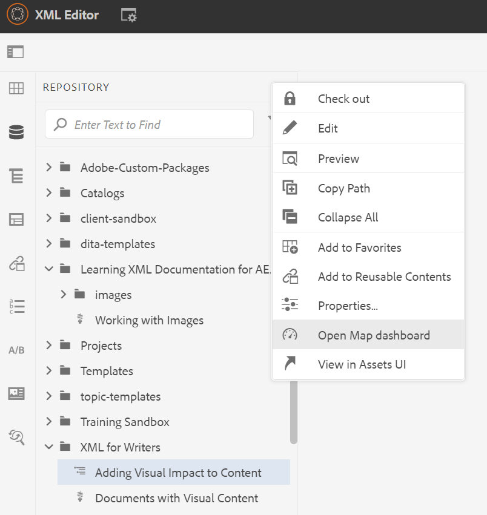
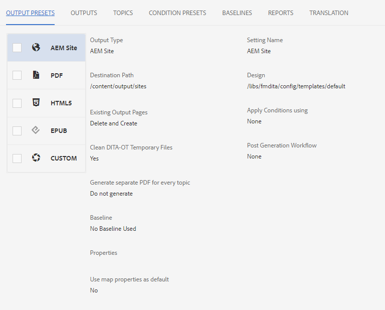
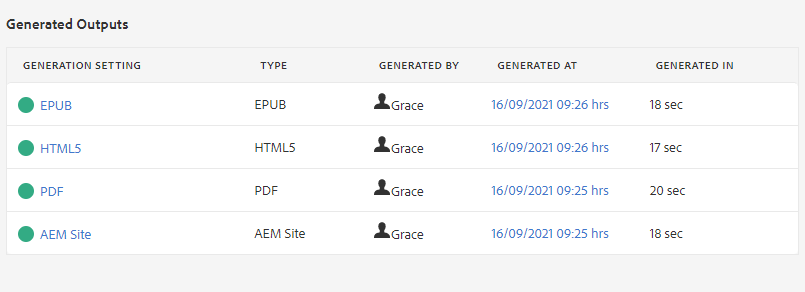
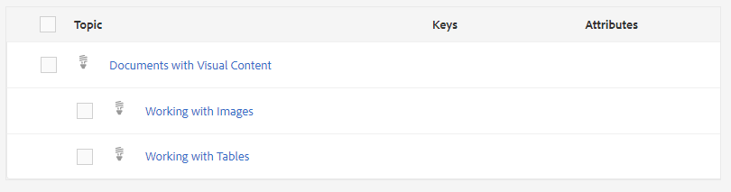
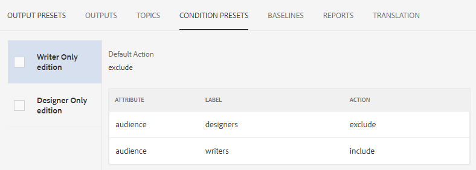
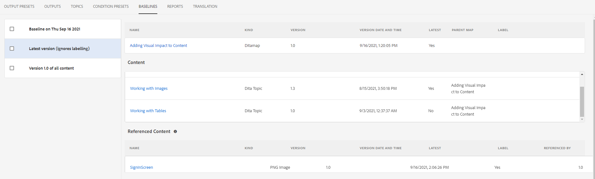
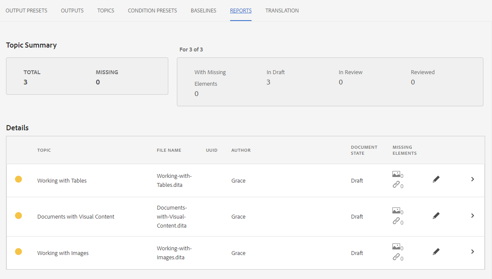

# Introduction to the Map Dashboard

The following will provide an overview of the map dashboard’s main features.

>[!VIDEO](https://video.tv.adobe.com/v/339040)

## Open a map in the Map Dashboard

1. In Repository View, select the Ellipsis icon on your map to open the Options menu, and then Open Map Dashboard.
    
 
    The Map Dashboard opens in another tab.

## Components of the Map Dashboard

The Map Dashboard contains a number of tabs, including output presets, output results, topic used, baselines, and more.

### Output Presets

The Output Presets tab displays the default presets for the different types of outputs: AEM Site, PDF, HTML5, ePub, and Custom. 

 
You can select an output preset to view the details of its settings, including the transformation name, destination path, baselines, and applied conditions.

### Outputs

The Outputs tab displays all previously generated and currently generating outputs. 

A green circle under the Generation Settings column indicates that the output has been generated successfully. The text in this column acts as an active hyperlink, and you can select them to open the generated output. The entries under the Type column indicate the output type. 
Other output generation information is also displayed here, including the name of the user that generated the output, the date and time of generation, and the time it took for the generation to occur. If there is an error during generation, you can select the date and time of generation under the Generated At column to open and review the error log.

### Topics

The Topics tab displays a list of all your topics within the map. 

Selecting a topic’s checkbox allows you to perform additional actions. You can edit it, regenerate it, and show, apply, or hide its tags. 

### Condition Presets

The Condition Presets tab displays the settings for specific conditional content to be included or excluded.

Here, selecting the checkbox for the Writer Only edition will result in an output that excludes all content with the “audience” attribute that has the “designers” label, and includes all content with the “writers” label. 

### Baselines

The Baselines tab allows you to view your baselines. 

Baselines act as snapshots in time, and allow you to create a version of your topics and assets for publishing. For example, a baseline that captures content at a specific date and time can use version 1.3 of one topic, and 1.0 of another topic, based on their respective versions at the time.
If there is no baseline specified, then the output is generated with the latest versions of all content.

### Reports

The Reports tab displays a summary of topic information, including the number of total topics in use, missing elements within these topics, and the document state.

If a topic is missing an element, you can select the rightmost arrow in the row to expand the entry and view details about the error.
