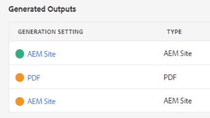
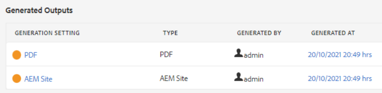
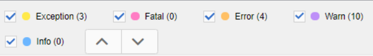

# Troubleshooting Publishing Errors

Publishing a map is usually simple. Open the map, select an Output Preset, and generate output! However, if a map, or its topics have errors in them the output generation can fail. When this happens, it’s important to know how to troubleshoot.

>[!VIDEO](https://video.tv.adobe.com/v/338990)

## Preparing for the exercise

You can download sample files for the exercise here.

[Exercise-Download](assets/exercises/publishing-basic-to-advanced.zip)

## Common causes of publishing errors

Errors may be introduced in source content. For example:

* Incorrectly named file path reference

* Incorrectly named folder

* Missing graphic or file

* Incorrectly configured content reference

* Broken cross-reference

* Errors in the values for an attribute (e.g. a string rather than a number)

* Incorrect setup of components used by XML Documentation

## Impact of errors

An error may be minor and result in a simple note to let you know that a file was not successfully packaged, or severe enough that it results in a complete failure to generate output. The Outputs tab displays color coded icons to show success, errors, or failures related to output generation.

 
## Opening and reviewing error logs

The log file that is generated can be opened for review.

1. In the **Outputs** tab, click the **date/time under Generated At.**

    
 
2. Scroll through the error log.

## Showing and hiding error types

The error log displays each error type in a unique color.

 
1. **Select** or **deselect** any error type to show or hide highlighting.

2. Navigate errors using the **next** or **previous** buttons (arrows).

## Resolving errors

Depending on the type of error the resolution may be simple or complex. It may be completed by an author in XML Editor, or may require an administrator to work with XML Documentation. Specific corrections depend on the error, the impact, and your organizational workflows.

* Incorrectly named file path reference

        Authors can update the path reference in the source document.

* Incorrectly named folder

        Authors can update the folder name or move files as needed.

* Missing graphic or file

        Authors can upload a missing graphic/file, rename a graphic/file, or move a graphic/file

* Incorrectly configured content reference

        Authors can correct the location of the content referenced, or change the path to the content reference.

* Broken cross-reference

        Authors can correct the location the cross-reference points to, or change the destination file name or properties

* Errors in the values for an attribute (e.g. a string rather than a number) 

        Authors can update the attribute to a correct value or administrators can update the system to support new values.

* Incorrect setup of components used by XML Documentation

        Administrators can update the installation of the system, its components, or permissions.
