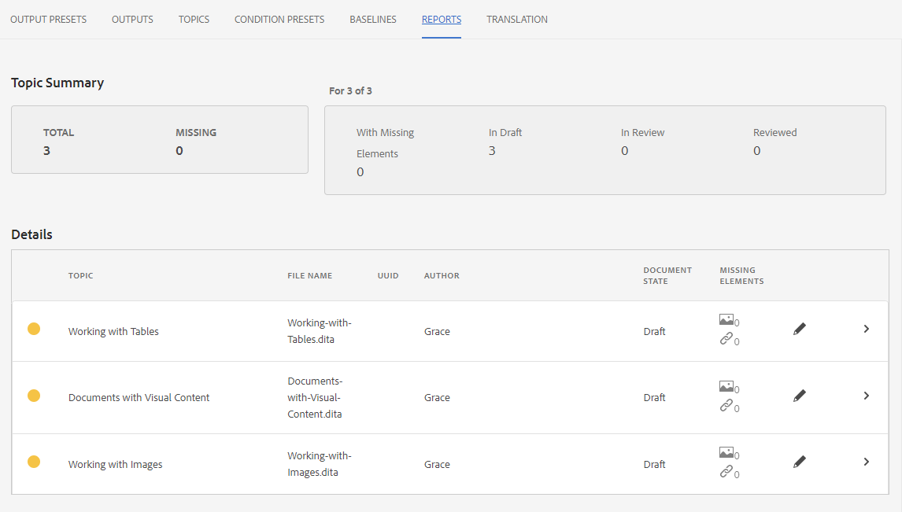

# Working with Reports

The Reports tab in the Map Dashboard allows you to identify and resolve broken links, content that is referenced and reused (conrefs), cross references, or other missing information. 

>[!VIDEO](https://video.tv.adobe.com/v/339039)

## Preparing for the exercise

You can download sample files for the exercise here.

[Exercise-Download](assets/exercises/working-with-reports.zip)

## Uploading Assets

1. In Repository View, select the Ellipsis icon on your main folder to open the Options menu.

    
 
2. Select **Upload Assets**.

    
 
3. Select the files you would like to upload to the folder, and select **Upload**.
    
The DITA files open and you should review them for issues with missing content, conrefs, or cross references.

## Creating a map

1. Select the Ellipsis icon on your main folder to open the Options menu.

    
 
2. Select **Create > Map**.

    

    The Create New Map dialog displays.

3. In the Template field, select **Bookmap** (or **Map** based on the content type you are creating) from the drop-down menu and give your map a title.

4. Select **Create**.

Your map is created, and the left rail automatically changes from the Repository view to the Map view.

## Inserting map components

1. Select the pencil icon in the left rail.
This is the Edit icon, and allows you to open the map in the editor.

    

2. Switch back to Repository view by selecting the Repository icon.

    

3. Add a topic to the map by dragging and dropping it from the Repository into the map in the editor.
The line indicator will show you where your topic will be placed.

4. Continue to add topics as needed.

5. When finished, select **Save As New Version.**
 
    

6. In the *Comments for new Version* field, enter a descriptive comment.

7. Select **Save**. 

## Generating an AEM Site output

1. In the Repository, select the Ellipsis icon on your map to open the Options menu, and then **Open Map Dashboard.**

    

    The Map Dashboard opens in another tab.
2. In the Output Presets tab, select **AEM Site**.

    
 
3. Select **Generate**.

4. Navigate to the Outputs page to view the status of your generated outputs.
If there are errors the Outputs tab may display an orange circle under the Generation Setting column instead of green, indicating that generation is complete.

5. Select the link under the Generation Setting column to open the generated output.
Review your output for missing content.

## The Reports tab

The Reports tab displays a topic summary, and a table containing topic information and the issues within your map. 

Ideally you always check the Reports for a map after importing content.

The Missing Elements column indicates the number of missing images and broken conrefs. You can select the **Pencil** icon to open the topic in the editor.

## Resolving missing images

If images are missing from your files a common cause might be that content has been uploaded, but images have not. If so, resolve the missing image issues by uploading images to a specific folder matching the path and filenames expected by files.

1. In *Repository View*, select the Ellipsis icon on your images folder to open the Options menu.

       
 
2. Select **Upload Assets**, and select the missing images.

3. Select **Upload**.

The missing images have been uploaded. Now, a newly generated AEM Site output will display these images, and the Reports tab will no longer display any missing image errors.

## Resolving broken conrefs

If content that is referenced elsewhere (a conref) links to for a file within another folder (for example, one named “reuse.”) and the content is not uploaded, an error must be resolved. For example, you must create a subfolder named “reuse,” and upload the missing file into “reuse.”

### Uploading an asset with the Assets UI

In addition to the Upload Assets option, you can upload assets by dragging and dropping into the Assets UI.

1. In Repository View, select the Ellipsis icon on your reuse folder to open the Options menu.

    
 
2. Select **View in Assets UI**. 

    
 
3. Drag and drop the file into the folder.
The file is uploaded, and the conref error is resolved.

All the errors have now been resolved. The Reports page will indicate that there are no more errors, and generating an AEM Site results in a complete output with no missing components.
