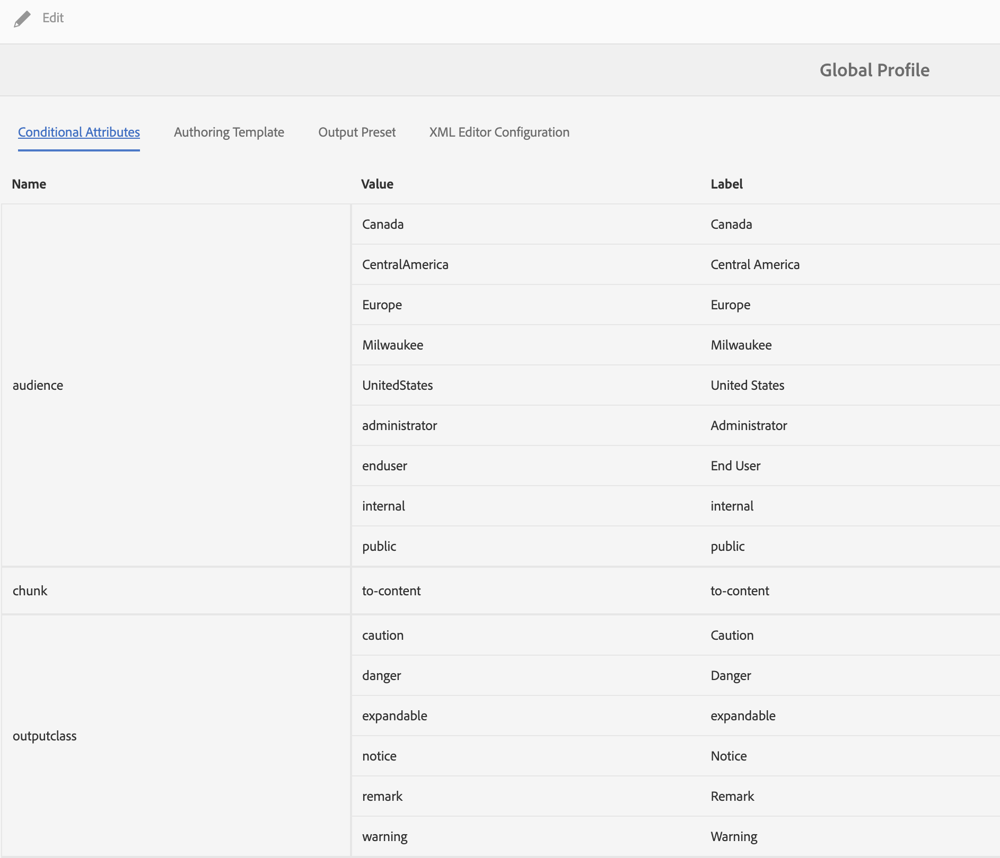

# Create and use conditions and generate conditional output

**Use case**

* Authors can set conditions on a piece of content so they can control whether it is displayed in the output.

* Authors can choose upon publication to show/hide different conditions.

* For example, authors can add attributes as version 1.0 and version 2.0 in the content, and use conditions to include version 1.0 for release 1.0 and exclude version 2.0.

**Step 1**

Define conditions relevant to the documentation in Folder Profiles: 
Refer to section **Configure conditional attributes for global or folder-level profiles** in [Page 64 of the Installation and Configuration Guide](https://helpx.adobe.com/content/dam/help/en/xml-documentation-solution/3-8/XML-Documentation-for-Adobe-Experience-Manager_Installation-Configuration-Guide_EN.pdf)

**Step 2**

Select the Folder Profile defined in Step 1 in **User Preferences** in XML Editor: 
Refer to section **User Preferences** in [Page 39 of User Guide](https://helpx.adobe.com/content/dam/help/en/xml-documentation-solution/3-8/XML-Documentation-for-Adobe-Experience-Manager_User-Guide_EN.pdf)

**Step 3** 

Use the conditions to conditionalize sections of content : 
Refer to section **Conditions** in [Page 81 of User Guide](https://helpx.adobe.com/content/dam/help/en/xml-documentation-solution/3-8/XML-Documentation-for-Adobe-Experience-Manager_User-Guide_EN.pdf)

**Step 4** 

Define condition presets at map level to choose which conditions to enable in the output : 
Refer to section **Use condition presets** in [Page 184 of User Guide](https://helpx.adobe.com/content/dam/help/en/xml-documentation-solution/3-8/XML-Documentation-for-Adobe-Experience-Manager_User-Guide_EN.pdf)
