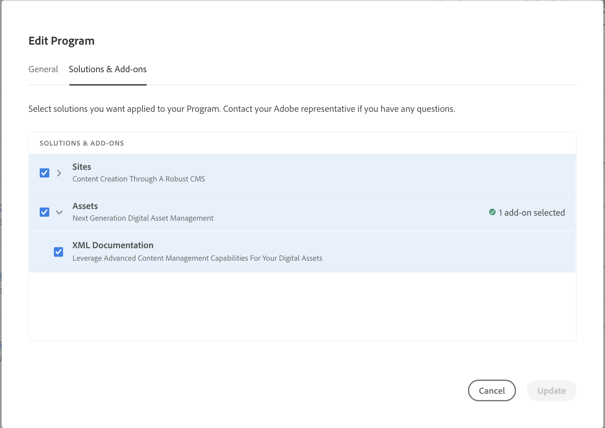

# XML Documentation for AEM as a Cloud Service Deployment

## Manual Deployment via Cloud Manager git pipeline

For customers who purchased XML Documentation for AEMaaCS before 03/29/2022, please follow these deployment instructions: 

* If you are starting fresh, you can replace the code automatically generated by cloud manager with the code from the below repo which has XML plugin already integrated: https://github.com/Adobe-TCS/XML-documentation-for-AEMaaCS

* If you already have checked-in customizations in cloud manager git repo, you can refer to the below repo for the instructions on how to add XML plugin in your existing code: https://github.com/Adobe-TCS/DoX-Installer-for-AEMaaCS

## Deployment Via Cloud Manager

If you are a customer who purchased XML Documentation for AEMaaCS on or after 03/29/2022, please follow these instructions to add XML Documentation to your AEM as a Cloud Service environment:

* Login to cloud manager 
* Edit the program for which you want to configure XML Documentation
* Switch to "Solutions and Add-ons" tab
* In the "solutions and add-ons" table, click on Assets
* Select "XML Documentation" and press save

You have successfully configured your program for automatic provisioning of XML Documentation solution.

NOTE: To intall XML Documentation on any environment under the integrated program, you must run the pipeline assoicated with the environment. No additional configuration is required in your CM git codebase for installing XML Documentation.
