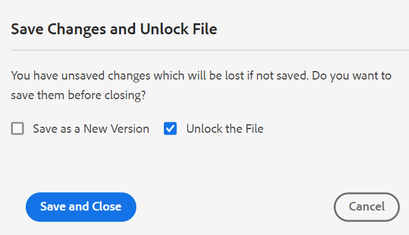
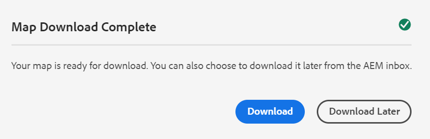

# Latest XML Documentation release for AEMaaCS

## Upgrade to the latest release

Upgrade your current Cloud Services setup by performing the following steps:
1. Checkout the Cloud Services' Git code and switch to the branch configured in Cloud Services pipeline corresponding to the environment you want to upgrade.
2. Update `<dox.version>` property in `/dox/dox.installer/pom.xml` file of your Cloud Services Git code to 2022.1.78.
3. Commit the changes and run the Cloud Services pipeline to upgrade to the latest release of XML Documentation.

## Compatibility matrix

This section lists the compatibility matrix for the software applications supported by XML Documentation solution Cloud Services February 2022 release. 

### FrameMaker and FrameMaker Publishing Server

| FMPS | FrameMaker |
| --- | --- |
| Not compatible | 2020 Update 4 and above |
| | |

### Oxygen Connector

| XML Documentation Cloud Release | Oxygen Connector Windows | Oxygen Connector Mac | 
| --- | --- | --- |
| 2022.2.0 | 2.4.0 | 2.4.0 | 
|  |  |  |  

## New features and enhancements

### Native PDF publishing

Support for creating a native PDF has also been added in the February release of XML Documentation solution. A new publishing engine has been introduced with the following features:
* Create a CSS template
* Create different page templates
* Design PDF templates comprising CSS and page templates
* Publish map and topic content in PDF format 

**Note**: Currently, this is being released as a beta feature. If you wish to know more about this feature, contact your customer success manager.

### Support for knowledge base site path in Article-based publishing

XML Documentation solution as Cloud Services provides the article-based publishing feature to incrementally generate an output of one or more topics or publish your content to a knowledgebase platform. With the February release, you have an additional option to choose the Knowledge Base site path to which the topic/map needs to be published. Once you select the path, the output is generated at the specified path.  

### Web Editor enhancements

Many enhancements and new features have been added in the Web Editor:

* **Improved dialog on file close**

XML Documentation solution prompts you to save your changes and unlock your locked files when you try to close a file opened in the Web Editor. The prompts are displayed based on the **Ask for check-in on close** and **Ask for new version on close** settings configured by your administrator.

Based on the configuration, you get the option to save the changes and create a new version of your document. Or, you can also check in the file and save the changes to the current version.  

For more details, see *File close and save scenarios* in the User Guide.

* A non-breaking space has been added to the character pallet.  A **non-breaking** space prevents an automatic line break at a particular point in an HTML document. Web Editor supports a non-breaking space for both AEM Site and HTML5 output.

* When you upload an image from the Web Editor, a confirmation dialog is displayed if an image with the same name already exists. You can either keep both files - existing and the new file, or overwrite the existing file and save only the new file.  

* If any user has locked any file for edits, an administrator can release the lock and check in the file. This feature will be helpful when some files need to be edited but have been locked by users who are not available to check in the file

### Map dashboard

When you select to download the DITA map, the request is queued, and you receive a notification once the map is ready to download. You can choose to download the map file immediately or download it later from the link provided in the AEM notification Inbox. 

### Review

You can mention the details in the description field of the review task, and it is displayed in the email sent to the reviewer. 

## Fixed issues

The bugs fixed in various areas are listed below:

### Article based publishing

* Article-based publishing does not publish articles based on the selected baseline. (8771)
* DITAVAL files are not honored in article-based publishing. (8770)
* Unable to do article-based publishing for Salesforce profile when record type is FAQ and article field content is Question. (8448)
* Unable to do article-based publishing for Salesforce profile when record type is Manual. (8447)

### Web Editor

* Dragging and dropping a condition doesn’t work on DITA topics. (8761)
* Attributes are  missing on adding a chapter into bookmap using Drag-and-drop from the Favorites view. (8746)
* Editing the properties of an image (height, width) results in an application error. (8722)
* Broken links do not appear within the Outline panel in the source view. (8590)
* XML Editor removes newline tag in codeblock. (8522)
* Glossusage is shown as a Note when a Glossentry is authored. (8384)
* xref cannot be inserted even at valid locations. (8354)
* The element list (Alt+Enter) appears grayed out in Dark/Darkest theme. (7913)
* The list of map templates in **Create** option( ellipsis menu) of the Repository panel is not as per the **Folder Profile** in User Preferences. (5918)
* Element IDs are not automatically generated for elements added from the Reuse Content feature of the main toolbar. (5826)

### Assets UI

* Image editing not working as expected on the cloud server. (8768)
* Within the version history panel, the current version section shows incorrect timestamp and modified by information. (8765)
* DITAVAL file upload on cloud server fails when AEM desktop tool is used. (8707)
* The second administrator user cannot be added as the first administrator user to a folder. (8430)
* Non-unique properties of an asset are not copied when the asset is copied and pasted. (8241)

### Usability changes

* In the Review panel of the Web Editor, if a username is long, the icons to accept/reject are not displayed clearly. (8793)
* In the **Find and Replace** panel, an unwanted icon appears on the mouse hover in the result section. (8775)
* Custom icon is not picked from the property and instead default icon is displayed for the reports generated using the Generate Report button. (8573)
