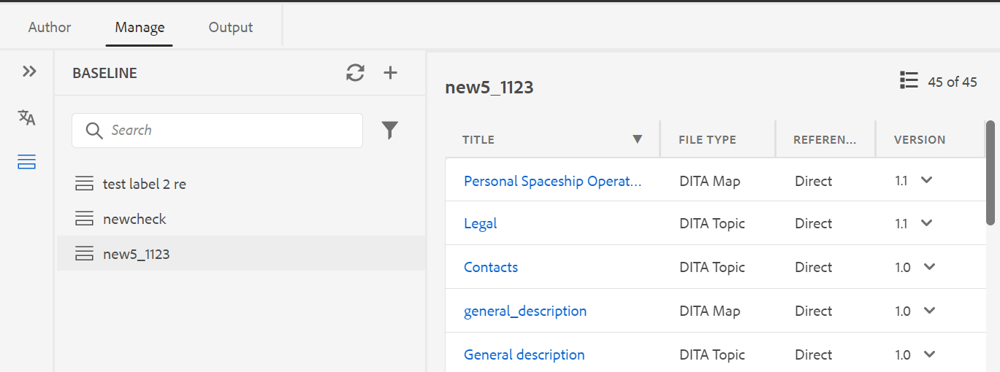
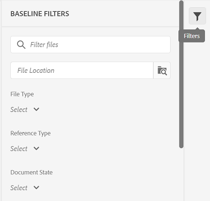

# Latest release of XML Documentation for Adobe Experience Manager as a Cloud Service 

## Upgrade to the latest release

Upgrade your current XML Documentation for Adobe Experience Manager as a Cloud Service (later referred as *XML Documentation for AEMaaCS*) setup by performing the following steps:
1. Check out the Cloud Services' Git code and switch to the branch configured in the Cloud Services pipeline corresponding to the environment you want to upgrade.
2. Update `<dox.version>` property in `/dox/dox.installer/pom.xml` file of your Cloud Services Git code to 2022.1.78.
3. Commit the changes and run the Cloud Services pipeline to upgrade to the latest release of XML Documentation for AEMaaCS.

## Compatibility matrix

This section lists the compatibility matrix for the software applications supported by XML Documentation for AEMaaCS March 2022 release. 

### FrameMaker and FrameMaker Publishing Server

| FMPS | FrameMaker |
| --- | --- |
| Not compatible | 2020 Update 4 and above |
| | |

### Oxygen Connector

| XML Documentation Cloud Release | Oxygen Connector Windows | Oxygen Connector Mac | 
| --- | --- | --- |
| 2022.2.0 | 2.4.0 | 2.4.0 | 
|  |  |  |  

*Baseline and conditions created in AEM are supported in FMPS releases starting from 2020.2.

## New features and enhancements

### New Baseline dashboard

XML Documentation for AEMaaCS March release provides the Baseline feature integrated inside the Web Editor. You can now create baselines from the Web Editor and use them to publish or translate topics of different versions.

Note: For upgraded system, please update the latest **ui_config.json** for Folder Profile.

Use this feature to create a baseline with a specific version of the topics available on a specific date and time. Also, you get the API support to create or update a baseline with a label defined for a version of topics. 

You can search the files based on filenames, or file location. You can also filter the topics to be displayed in the baseline editing window and sort them based on specific columns. 

The performance for the baseline creation process has been further improved. The process to create baselines is asynchronous, so you can continue editing other files in the Web Editor while the baseline is being created. For more details, see *Create and manage baselines from the Web Editor* in the User Guide. 

Note: The Baseline tab on the map dashboard is hidden by default. Your administrator can enable the Baseline tab on the map dashboard.

### Improved Web Editor refresh behavior

The following  enhancements are now available with the browser refresh operation in the Web Editor:

* Now you get the support to refresh the browser while you edit your 
content in the Web Editor. If you hit the browser refresh icon while one or more files with
unsaved changes are opened for editing, you are prompted to save your files or cancel the refresh action. 

* Even on refreshing the browser, the views of the left panel and the right panel are retained.  

* The active topic or DITA map is reopened in the content editing area.

### Publishing enhancements

The publishing process has been further improved with the latest release of XML Documentation for AEMaaCS:

* Baselines have been honored for the metadata of AEM site output. You can also process the properties of a baseline version as metadata. If no baseline is defined, then the properties of the latest version are processed as metadata.

* The **File Name** and **DITA-OT Command Line Arguments** options have been added for HTML5, EPUB, and Custom output presets. Now you can specify the file name with which you want to save the output. You can also specify the additional arguments that you want DITA-OT to process while generating output.

## Fixed issues

The bugs fixed in various areas are listed below:

* Unable to add frontmatter, backmatter elements in a bookmap using the Author view of the Web Editor. (7652)
* Reference tree breaks after removing a topic and performing a move operation. (8804) 
* Exception is received on viewing the content after uploading an asset. (3638)
* Error occurs when files whose parent folder has special characters in the filename, are opened in Oxygen (using the **Edit in Oxygen** button). (8918)
* The **Locate In Repository** option does not locate and highlight the DITA map in XML Editor. (8796)
* Filtering is not showing the appropriate results when multiple attributes are added to the content in XML Editor. (8795)
* Error occurs on adding a user as an administrator in the folder profile when the user ID is numeric. (8908)

## Known issues

Adobe has identified the following known issue in the XML Documentation for AEMaaCS March release.

* Removing labels on direct references also removes the labels from indirect references.

* Unable to reflect the updated baseline title without manually refreshing the baseline panel.

* The version preview feature in the Version History panel does not show the preview of a selected topic.