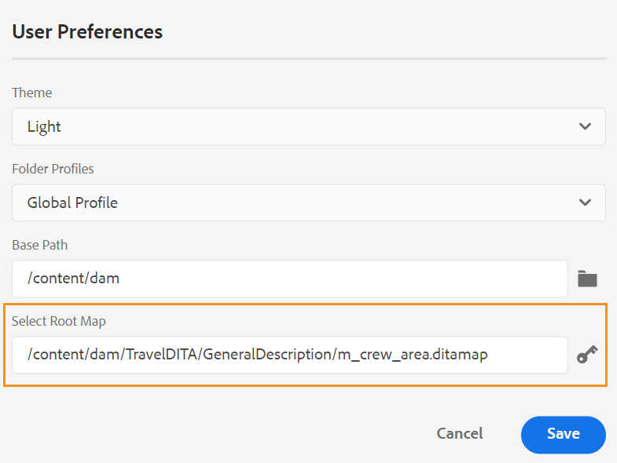
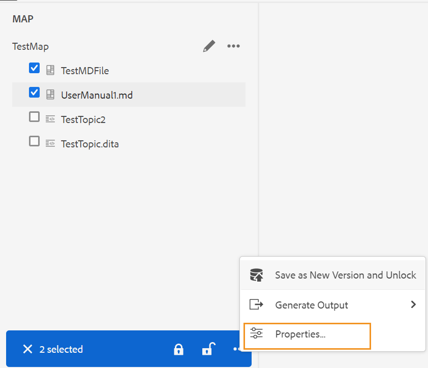
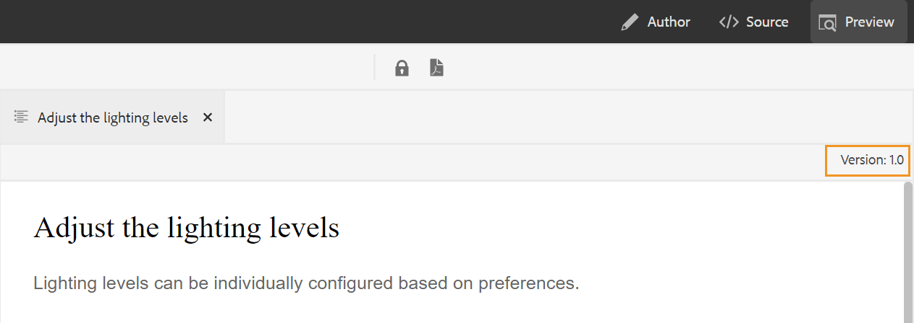

# Latest release of XML Documentation for Adobe Experience Manager as a Cloud Service 

## Upgrade to the latest release

Upgrade your current XML Documentation for Adobe Experience Manager as a Cloud Service (later referred as *XML Documentation for AEMaaCS*) setup by performing the following steps:
1. Check out the Cloud Services' Git code and switch to the branch configured in the Cloud Services pipeline corresponding to the environment you want to upgrade.
2. Update `<dox.version>` property in `/dox/dox.installer/pom.xml` file of your Cloud Services Git code to 2022.3.123.
3. Commit the changes and run the Cloud Services pipeline to upgrade to the latest release of XML Documentation for AEMaaCS.

## Compatibility matrix

This section lists the compatibility matrix for the software applications supported by XML Documentation for AEMaaCS April 2022 release. 

### FrameMaker and FrameMaker Publishing Server

| FMPS | FrameMaker |
| --- | --- |
| Not compatible | 2020 Update 4 and above |
| | |

### Oxygen Connector

| XML Documentation Cloud Release | Oxygen Connector Windows | Oxygen Connector Mac | 
| --- | --- | --- |
| 2022.4.0 | 2.4.0 | 2.4.0 | 
|  |  |  |  

*Baseline and conditions created in AEM are supported in FMPS releases starting from 2020.2.

## New features and enhancements

Many enhancements and new features have been added in the Web Editor:

### Improved key resolution

A DITA content key reference inserts a part of content from one topic into another. It uses a key to locate the content. The key references associated with a DITA topic need to be resolved. The selected root map takes the highest precedence to resolve key references. 

Now the key references are resolved on the basis of the root map set in the following order of priority: 

1. User Preferences
2. Map View panel 
3. Folder Profile

For more details, see *Resolve key references* section in the User guide.

### Add a custom panel in the left panel

Now you can add a custom panel within the left panel of the Web Editor. You can use a custom panel for various purposes like providing help or doing the testing for a project. If a custom panel has been configured, then it also appears in the list of panels within the **Editor Settings**. You can toggle the switch to show or hide the custom panel.

### Ability to change the document state of topics in a DITA map

Now you can easily change the document state of selected topics within a DITA map. You can also open and edit the properties of selected topics in a DITA map from the **More Options** menu at the bottom of the Map View panel.

### Version information displayed in the Preview mode

The Web Editor helps you in managing your versions. Now you can also see the version of the active topic or DITA map in the top right corner of the topic's file tab in the Preview mode of a topic.

## Fixed issues

The bugs fixed in various areas are listed below:

* New labels are not reflected automatically in the Add/Remove label dropdown, instead, a Baseline refresh is required. (9249)
* Unable to edit the baseline title if a baseline is created by label criteria. (9171) 
* Output purging feature fails if the user has a large number of leftover output history nodes.(8568)
* Publishing job using a baseline gets stuck in "waiting" state if the baseline status changes to "failed". (9194)
* Removing labels on direct references also removes the labels from indirect references. (9257)
* Searching as you type causes unwanted search requests in the Repository view. (9307)
* Issues occur when any keyword is used in the title for tab. (9318)
* Baseline fails on adding a label having spaces. (9362)
* AEM site output doesn't display glossusage element correctly. (8936)
* Console error occurs on opening the **Output** tab in the Web Editor. (8715)
* Error message displayed on publishing a manual record type via Salesforce is not intuitive. (8952) 
* Validate with condition attributes setting is not opened immediately, instead the user needs to reopen the file to see the validations. (9300)
* Metadata can't be removed once a DITA map is published with metadata.  (9178)
* Translation panel is visible even on opening the DITA map in the Map Editor. (9053)
* Custom DTD defined by the user does not take precedence over standard DITA DTD embedded in DITA-OT. (9104)
* In the Native PDF feature, the upload in the templates fails for non-DITA and non-image files. (9070)
* Authorization mechanism executes two queries instead of one, in some specialized scenarios. (9221)
* Publishing the AEM site output fails on using custom DTD. (9243)
* Use-by-reference footnote doesn't scroll to the footnote section in AEM site output. (9234) 