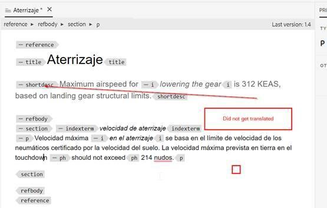

# How to exclude paragraphs within a topic from translation

Easiest way is to make use of translation=no attribute.

+ Authors can insert the additional attribute as **translation=no** on the paragraphs that they do not want to translate. The translation vendor needs to be informed and they can do configuration at their end to ignore the text with this attribute.
+ The OOTB machine translation (with trial Microsoft Translation connector) exhibits the same behavior.
+ Testing with Microsoft Translation : if you define **translate=no** attribute at paragraph level then it doesn’t translate the complete paragraph. This attribute can be defined at any element and the content inside that element will not be translated.

Here are a few screenshots that explains this further: 

**Source Content**

**Translated Content in Spanish**

