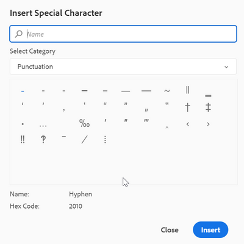
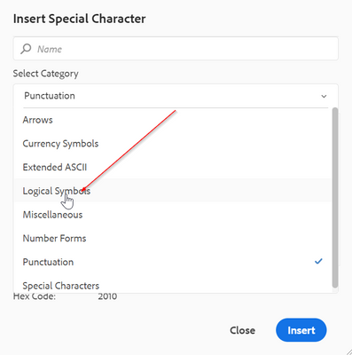
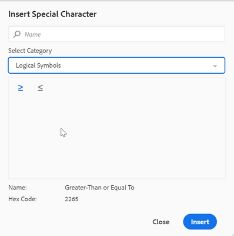

# How to configure additional special characters in Web Editor toolbar

There is a shortcut option in the web-editor toolbar to let author insert the special characters already. 
The same can be seen in screenshot below:




These list of characters is configurable here. If you need to add more characters to this then follow the below steps:

+ Log into AEM and open the CRXDE Lite mode.

+ Create symbols.json file at the following location: '/apps/fmdita/xmleditor/' (You can copy the default from - '/libs/fmdita/clientlibs/clientlibs/xmleditor/symbols.json' location)

+ Add the special character definition in the symbols.json file as:

``` 

{
      "label": "Logical Symbols",
      "items": [
        {
          "name": "≥",
          "title": "Greater-Than or Equal To"
        },
        {
          "name": "≤",
          "title": "Smaller-Than or Equal To"
        }
      ]
}

``` 

The structure of the symbols.json file is explained below:

+ "label": "Logical Symbols": This specifies the category for the special characters. In the snippet, a category with the name "Logical Symbol" is defined.

+ "items": This defines the collection of special characters in the category.

+ "name": "≥", "title": "Greater-Than or Equal To": This is the definition of the special character. It starts off with the "name" label, which must not be changed. The name is followed by the special character. The "title" is the name or title of the special character that appears as the tooltip for that special character.

You can define multiple definitions of special characters within a category.

This will add another category in special characters dialog:





>[!MORELIKETHIS]
>
>+ [Installation and Configuration Guide](https://helpx.adobe.com/content/dam/help/en/xml-documentation-solution/3-6/XML-Documentation-for-Adobe-Experience-Manager_Installation-Configuration-Guide_EN.pdf)
