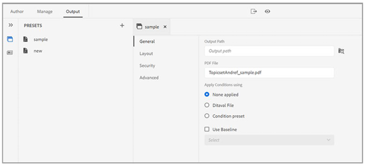
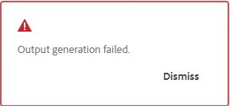

# Publish a PDF output

With the XML Documentation solution, you can generate PDFs of individual topics or an entire map file. You can publish your content in a PDF format using one of the three methods below: 

* **DITA-OT**  

Use this method to generate a PDF output for a map from the map dashboard. You can set publishing properties before generating the PDF by creating an output preset for the map that is open in the map dashboard. To create or edit an output preset, the *Understanding the output presets* section in the [XML Documentation for AEM as a Cloud Service User Guide](https://helpx.adobe.com/content/dam/help/en/xml-documentation-solution/cs-mar-22/XML-Documentation-for-Adobe-Experience-Manager_CS_User-Guide_EN.pdf). 

For more information on generating a PDF using the DITA-OT method, see [Generate PDF using DITA-OT](https://help.adobe.com/en_US/xml-documentation-for-adobe-experience-manager/index.html#t=DXML-master-map%2Fgenerate-output-pdf.html). 

* **FrameMaker Publishing Server (FMPS)**

Use this method to generate a PDF output from not only the DITA content, but also FrameMaker documents (.book and .fm) available in your AEM repository. The PDF can be created by configuring an output preset and published using FrameMaker Publishing Server (FMPS). You can design and configure the look-and-feel of your output for PDF and other formats and store the same in a setting file (.sts). This setting file is then used by FMPS to generate output for a DITA map or .book file. To create or edit an output preset, see the  *Understanding the output presets* section in the [XML Documentation for AEM as a Cloud Service User Guide](https://helpx.adobe.com/content/dam/help/en/xml-documentation-solution/cs-mar-22/XML-Documentation-for-Adobe-Experience-Manager_CS_User-Guide_EN.pdf).

For more information on configuring FMPS, see [Generate output from FrameMaker documents](https://help.adobe.com/en_US/xml-documentation-for-adobe-experience-manager/index.html#t=DXML-master-map%2Ffm-output-generatation.html). 

* **Native PDF publishing** 

Use this method to generate a feature-rich PDF output based on W3C CSS3 and CSS paged media standards. With Native PDF publishing, you can use templates to set the layout and styling for your content and apply various settings to fine-tune your PDF. In addition, you can modify and create your own templates with the template editor. 

 For more information on Native PDF publishing, see [Using Native PDF publishing](#native-pdf-publishing). 

## Using the Native PDF publishing {#native-pdf-publishing}

When authoring content, it becomes essential to ensure that the content is optimized for viewing, editing, and printing. Using standards such as the W3C CSS3 for content styling and CSS paged media standards for page definition properties such as size, margins, orientation, page breaks, headers, footers, and page numbering, you can set the view and layout for your PDF document ensuring consistency and usability. The Native PDF publishing feature uses these standards to generate a PDF. 

With the native PDF publishing, you can use predefined templates to ensure consistency in content layout and structure, apply stylesheets to alter the look-and-feel of your output, optimize PDF, set printer marks, allow screen reader support, set PDF conformance, embed fonts, and much more.  

Generating a PDF using Native PDF publishing has two aspects: 

* Use of templates to apply styling to content, set page layouts, and various settings to fine-tune your PDF. Authors can choose to use/modify the sample templates provided or create custom templates and set advanced configuration options used by publishers and developers. 

* Create or configure a PDF output preset to control the PDF settings. Once you create a PDF output preset, you can generate the PDF.  

For more information, see [Generate a PDF output](#generate-pdf-output).

## Create a PDF output preset {#create-output-preset}

The first step in generating a PDF output is to create a PDF output preset, which is a collection of publishing properties assigned to a map. You can create an output preset for any map which is open in the Map View panel or configure an existing preset to quickly generate a PDF for the same map. 

From the PDF output preset you can select a template, apply conditions, set restrictions to control how a user interacts with your PDF, configure advanced settings like compression, conformance, and more.  

To create or configure a PDF output preset: 

1. In the Output tab, click **Presets** in the left sidebar. 
The Preset panel opens. 

2. In the output **Presets** panel, do one of the following:  
   * Double-click a predefined PDF output preset to view it.
   * Click the + icon against **Presets** to add a new output preset of **Type: PDF**  
3. To configure settings of an existing PDF preset:   
   * Click the  **Options**  icon next to the desired output Preset and select **Edit**. 
You can use the following settings in the **General**, **Layout**, **Security**, and **Advanced** tabs to configure a PDF output preset: 

**General**

Use to specify basic output settings, such as specify output path, PDF file name, and more. 

| Setting  | Description|
| --- | --- |
|**Output Path**|   The path within the AEM repository where the PDF output is stored. Ensure that the output path is not located inside the project folder. If left blank, the output gets generated in the default DITA map output location.|
|  **PDF file**  | Specify a file name to save the PDF. By default, the PDF file name adds the DITA map name along with the preset name. For example, ditamap is ‘TestMap’ and the name of the preset is ‘preset1’ then the default name of the pdf will be ‘TestMap_preset1.pdf’.  |
| **Apply Conditions using** |   For conditionalized content, choose from the below options to generate a PDF output based on those conditions:  * **None Applied** Select this option if you do not want to apply any condition on the map and source content.   * **Ditaval File** Select a DITAVAL file to generate conditionalized content. To select, click against Condition Preset and locate the file.   * **Condition Preset** Select a condition preset from the drop-down to apply a condition while publishing the output. This option is visible if you have added a condition for the DITA map file. The conditional settings are available in the Condition Presets tab of the DITA map console. To know more about condition preset, see [Use condition presets](https://help.adobe.com/en_US/xml-documentation-for-adobe-experience-manager/index.html#t=DXML-master-map%2Fgenerate-output-use-condition-presets.html).  |
|  **Use Baseline**  | If you have created a Baseline for the selected DITA map, select this option to specify the version that you want to publish. See [Work with Baseline](https://help.adobe.com/en_US/xml-documentation-for-adobe-experience-manager/index.html#t=DXML-master-map%2Fgenerate-output-use-baseline-for-publishing.html) for more details.   |
 
**Layout**

Use to set page layouts and specify page view options for PDF output such as Page Display and set Zoom levels.

| Setting  | Description|
| --- | --- |
|**PDF Template**|   PDF templates provide a clear structure for defining page layouts, content styling, and applying various settings to your PDF output. Select from the PDF template drop-down options to choose your preferred template.  |
|  **Page Display**  | Use the Page Display for page view that shows how the PDF is displayed when it is opened. Select from the Page Display drop-down options to choose a preferred view.  * **Default**  Displays as per the default setting of the PDF viewer on a user’s machine.    * **Single Page View** Displays one page at a time.     * **Single Page Scrolling** Displays a single page in a continuous vertical column.    * **Two Page View** Displays two-page spread side-by-side at a time. .  * **Two Page Scrolling** Displays two-page spread side-by-side with continuous scrolling. |  
|  **Zoom**  | Select to resize the page view that shows how the PDF is displayed when it is opened.   * **Default** Displays as per the default setting of the PDF viewer on a user’s machine      * **100%** Makes the page appear in its actual size.       * **Fit Page** Makes the page width and height to fit within the document pane.   .  * **Fit Page Width** Makes the width of the page fill the width of the document pane.    * **Fit Page Height** Makes the height of the page fill the height of the document pane.  | 

**Security**

Protect your PDF by adding restrictions to open and read the file. Use the below options to avoid unauthorized access. 

| Setting  | Description|
| --- | --- |
|**Set password to open the document**|   Select to add a secure password to view your PDF file. Specify a password in the **User password** field. Users can open the PDF only by entering the password provided in this field.  |
|  **Set the document restrictions**  | Select to restrict how users can interact with your PDF. Specify a password in the **Owner Password** field for the below restriction settings to work.   * **Printing** Select to allow a user to print the PDF.   * **Draft quality printing** Select to allow a user to print the PDF in a lower resolution.    * **Content copying** Select to allow a user to copy contents from the PDF.     * **Annotations** Select to allow a user to add a note or comment in the PDF.    * **Content modifications** Select to allow a user to alter the contents in the PDF.    * **Content copying for accessibility** Select to allow screen readers to read and navigate content in PDF.    * **Document assembly** Select to allow users to insert pages in the PDF.    **Note**: The users need to enter the owner password to change any restrictions from the File > Properties in Adobe Acrobat. |  

**Advanced**

Use the following options to specify advanced settings to merge PDFs, use compression, select compliance standard, and more. 

| Setting  | Description|
| --- | --- |
|**Create accessible (tagged) PDF**|   Select this option to generate a PDF with tags. A tagged PDF makes it easier for screen readers to read and navigate content, hyperlinks, bookmarks, and so on. For example, if a table is tagged, the screen reader will know that it is reading the table and not just lines and text.  |
|  **Merge PDFs included in the TOC** | Select this option to merge existing PDFs into your output by adding them to your Table of Contents. The PDFs will be inserted at the location represented in the TOC and the pages will be incremented accordingly. |  
|  **Embed used fonts** | Select this option when using fonts that may not be installed on end user’s machine. With this option selected, the used fonts get embedded in the PDF, ensuring the user can see the PDF as intended even if the fonts are not installed on their machine.   **Note**: A font can be embedded only if it contains a setting by the font vendor that permits it to be embedded. Ensure you have the required setting or license before embedding a font.  | 
|  **Use automatic hyphenation** | With automatic hyphenation enabled, words at the end of lines are broken in grammatically correct places with a hyphen. |  
|  **Enable JavaScript** | Enable this option if you have a JavaScript code that you want to use to transform your content dynamically before generating a PDF. |  
|  **Embed multimedia files** | Select this option to include any audio, video, and any interactive content to the PDF. |  
|  **Use full compression to optimize the PDF size** | Select this option if you want to compress/reduce the size of a large PDF. Remember, compressing the PDF may reduce the file quality. | 
|  **Use image compression to optimize the PDF size** | Select this option if you want to compress/reduce the size of images used, in your PDF. Remember, compressing an image may reduce the image quality.  | 
|  **Use custom resolution (pixels per inch)** | It is the page display resolution at pixels per inch. Enter a preferred value in the field that appears when this option is selected. The default value is 96 pixels per inch. Set a higher value to fit more content in an inch, and vice versa, if you set a lower value. | 
|  **Show Watermark** | Select this option to render MathML equations present in your content. The equations will be ignored otherwise. | 
|  **Enable MathML equations** | Select this option to render MathML equations present in your content. The equations will be ignored otherwise by default.  | 
|  **PDF conformance** | It is the standard to which you intend to save your PDF to ensure it is compliant. Select from the dropdown to choose from the list of available PDF standards. For more details about the supported standards, see [About PDF standards](https://helpx.adobe.com/acrobat/using/pdf-conversion-settings.html#about_pdf_x_pdf_e_and_pdf_a_standards). | 

## Generate a PDF output  

Once you have configured the output preset you can generate output from the Presets panel, using the **Generate Preset** feature.  

1. Under the **Author** tab, select the **Repository** View.  
This opens the Repository panel.  

2. In the Repository panel, open the DITA map file in **Map View**.  

3. In the **Output** tab, click **Presets** to view the Preset panel. 
To create or configure an output preset, see [Create a PDF output preset](#create-output-preset). 
4. To save your settings, click the **Save All**  icon in the upper-left corner of the standard toolbar in the Output view.    
5. Click the **Generate Preset**  icon on the top bar.
You can view a progress bar next to the selected output preset in the Output Presets panel. 
6. Once the output generation is complete, click  **View Output**  icon on the top bar to view the output.  
A **Success** dialog box is visible at the lower-right corner of the screen.
If an output is not successful, the below error message is displayed.

To view the error log, click **Dismiss**, hover over the selected preset tab, and click  **Options** > **View Log**. 